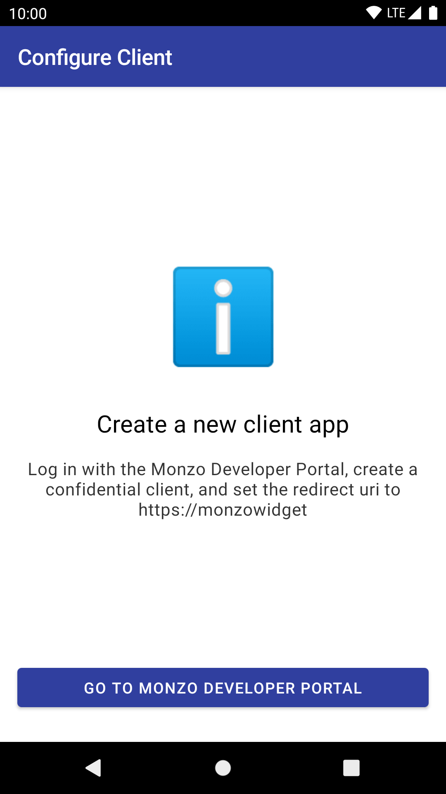

# Monzo widget

An Android app widget for your homescreen, showing the balance of your accounts or Pots.

## Configure Monzo client

| Landing page | Instructions | Enter client id & secret |
|---|---|---|
|  |  |  |

## Login flow

| Login page | Redirect to Monzo | Request magic link email | Open magic link |
|---|---|---|---|
|  |  |  |  |

| Log in | 2FA | Done! |
|---|---|---|
|  |  |  |
